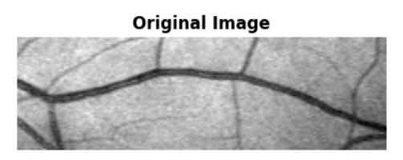
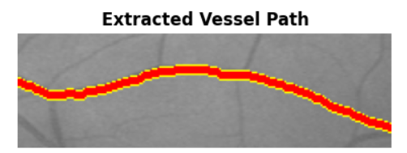
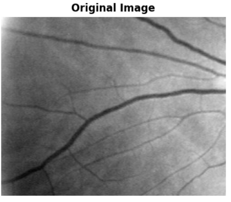
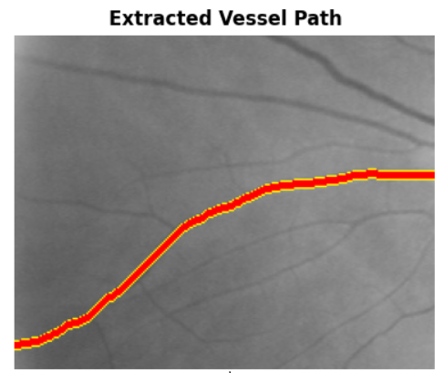
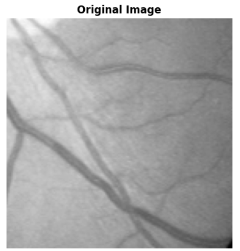
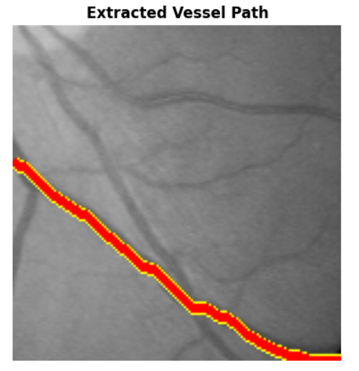

# 🏥 Vessel Path Extraction using Dynamic Programming

[](https://www.python.org/downloads/)
[](https://opensource.org/licenses/MIT)
[](CONTRIBUTING.md)

A novel approach for automated vessel path extraction in medical images using dynamic programming with gradient fusion and block averaging optimization. This tool provides guaranteed optimal path extraction with O(RC) time complexity and achieves significant performance improvements through intelligent resolution reduction.


## 📋 Table of Contents

- [Features](#features)
- [Algorithm Overview](#algorithm-overview)
- [Installation](#installation)
- [Usage](#usage)
- [GUI Interface](#gui-interface)
- [Technical Details](#technical-details)
- [Performance](#performance)
- [Examples](#examples)
- [Contributing](#contributing)
- [Citation](#citation)
- [License](#license)
- [Authors](#authors)

## ✨ Features

- **Guaranteed Optimal Solution**: Dynamic programming ensures globally optimal path extraction
- **Real-time Processing**: Block averaging provides up to 25× speedup with minimal quality loss
- **Interactive GUI**: User-friendly interface with real-time parameter adjustment
- **No Training Required**: Works immediately on new images without labeled data
- **Configurable Parameters**: Adjust diagonal penalty, block size, and visualization settings
- **Dual Starting Point Strategy**: Manual selection or automatic detection
- **Professional Visualization**: Clear before/after comparison with customizable overlays

## 🧮 Algorithm Overview

### Problem Formulation

Given a grayscale medical image I ∈ ℝ^(R×C), the algorithm finds the optimal path P that:
- Traverses from left to right (column 0 to column C-1)
- Follows vessel centerlines (dark pixels)
- Maintains geometric smoothness
- Minimizes global cost function

### Cost Function

```
C(r,c) = 0.7 × I(r,c) + 0.3 × ||∇I(r,c)||
```

Where:
- **I(r,c)**: Pixel intensity (vessels are darker)
- **∇I(r,c)**: Sobel gradient magnitude (edge information)
- **70/30 fusion**: Balances vessel detection with boundary localization

### Dynamic Programming Recurrence

```
dp[r][c] = C(r,c) + min {
    dp[r-1][c-1] + λ    (upper-left diagonal)
    dp[r][c-1]          (straight left)
    dp[r+1][c-1] + λ    (lower-left diagonal)
}
```

Where **λ** is the diagonal penalty (typically 5-10) that encourages smoother paths.

## 🚀 Installation

### Prerequisites

- Python 3.8 or higher
- pip package manager

### Step 1: Clone the Repository

```bash
git clone https://github.com/yourusername/vessel-path-extraction.git
cd vessel-path-extraction
```

### Step 2: Create Virtual Environment (Recommended)

```bash
# Windows
python -m venv venv
venv\Scripts\activate

# Linux/Mac
python3 -m venv venv
source venv/bin/activate
```

### Step 3: Install Dependencies

```bash
pip install -r requirements.txt
```

### Requirements File (`requirements.txt`)

```
numpy>=1.21.0
scipy>=1.7.0
Pillow>=9.0.0
matplotlib>=3.5.0
```

## 💻 Usage

### Running the GUI Application

```bash
python vessel_extractor_gui.py
```

### Basic Workflow

1. **Load Image**: Click "Load Image" and select a grayscale medical image
2. **Adjust Parameters** (optional):
   - Block Size: 1-5 (1=detailed, 5=fast)
   - Diagonal Penalty: 1-20 (higher=straighter path)
   - Line Width: 1-10 (visualization only)
3. **Select Starting Point** (optional): Click on vessel to specify starting row
4. **Extract Path**: Click "Extract Path" to run the algorithm
5. **Save Result**: Export the visualization with extracted path

### Command Line Usage

For batch processing or integration into pipelines:

```python
from vessel_extractor_gui import VesselPathExtractorGUI
import numpy as np
from PIL import Image

# Load image
img = Image.open('path/to/vessel_image.png').convert('L')
img_array = np.asarray(img)

# Create extractor instance
extractor = VesselPathExtractorGUI(None)  # Pass None for headless mode

# Run extraction
reduced_array, _, _ = extractor.block_average_image(img_array, block_size=3)
min_cost, path = extractor.extract_vessel_path(
    reduced_array, 
    start_row=None,  # or specify row number
    diagonal_penalty=8.0
)

# Scale path to original resolution
path_original = extractor.scale_path_to_original(path, block_size=3)

# Visualize
result = extractor.visualize_path(img_array, path_original, line_width=4)
result.save('output.png')
```

## 🖥️ GUI Interface

### Main Window Layout

```
┌─────────────────────────────────────────────────────────────┐
│           Vessel Path Extraction using DP                   │
├──────────────┬──────────────────────────────────────────────┤
│              │                                              │
│ 📁 File Ops  │          Original Image                     │
│              │                                              │
│ ⚙️ Parameters│                                              │
│  - Block     │                                              │
│  - Penalty   │  ──────────────────────────────────────     │
│  - Width     │          Result Image                       │
│              │                                              │
│ 🎯 Actions   │                                              │
│  - Select    │                                              │
│  - Extract   │                                              │
│  - Reset     │                                              │
│              │                                              │
│ ℹ️ Info Log  │                                              │
│              │                                              │
└──────────────┴──────────────────────────────────────────────┘
```

### Parameter Guide

| Parameter | Range | Default | Description |
|-----------|-------|---------|-------------|
| Block Size | 1-5 | 2 | Controls speed/accuracy tradeoff |
| Diagonal Penalty | 1-20 | 8.0 | Higher values = straighter paths |
| Line Width | 1-10 | 4 | Visualization line thickness |

## 📊 Technical Details

### Time Complexity

**Without Block Averaging:**
- Gradient computation: Θ(R × C)
- DP table construction: Θ(R × C)
- Backtracking: O(C)
- **Total: Θ(R × C)** - Linear in image size

**With Block Averaging (block size k):**
- Block averaging: Θ(R × C)
- DP on reduced image: Θ(R/k × C/k)
- **Speedup: k² times faster**

### Space Complexity

- DP table: O(R × C)
- Parent table: O(R × C)
- Gradient arrays: O(R × C)
- **Total: O(R × C)**

### Block Averaging Performance

For a 1024×1024 image:

| Block Size | Dimensions | Operations | Speedup | Memory |
|------------|------------|------------|---------|--------|
| 1 (none) | 1024² | 3.15M | 1× | 12.6 MB |
| 2 | 512² | 786K | 4× | 3.1 MB |
| 3 | 341² | 349K | 9× | 1.4 MB |
| 4 | 256² | 197K | 16× | 786 KB |
| 5 | 204² | 125K | 25× | 503 KB |

**Recommended:** Block size = 3 provides optimal balance (9× speedup, minimal quality loss)

## 📸 Examples

### Example 1: Clear Single Vessel

| Original | Extracted Path |
|----------|----------------|
|  |  |

**Parameters:** Block size = 2, Penalty = 8.0, Processing time = 15ms

### Example 2: Multiple Vessels

| Original | Extracted Path |
|----------|----------------|
|  |  |

**Parameters:** Block size = 3, Penalty = 10.0, Processing time = 11ms

### Example 3: Noisy Image

| Original | Extracted Path |
|----------|----------------|
|  |  |

**Parameters:** Block size = 3, Penalty = 8.0, Processing time = 12ms

## 🔬 Algorithm Correctness

### Optimal Substructure

**Theorem:** If path P* to pixel (r,c) is optimal, then its subpath to (r_{c-1}, c-1) is also optimal.

**Proof:** By contradiction - if a cheaper subpath existed, we could construct a cheaper overall path, contradicting optimality.

### Completeness

The algorithm examines all possible paths from left to right, considering all valid transitions at each step. By induction on columns, if column c-1 is optimal and we examine all predecessors for column c, then column c is optimal.

## 🎯 Use Cases

- **Retinal Vessel Analysis**: Diabetic retinopathy screening
- **Angiography**: Coronary artery disease assessment
- **Neurovascular Imaging**: Stroke risk evaluation
- **Surgical Planning**: Pre-operative vessel mapping
- **Longitudinal Studies**: Vessel change monitoring

## 🐛 Troubleshooting

### Common Issues

**Issue:** "No valid path found"
- **Solution:** Ensure image contains visible vessels. Try adjusting diagonal penalty.

**Issue:** Path is too jagged
- **Solution:** Increase diagonal penalty (try 10-15).

**Issue:** Path deviates from vessel
- **Solution:** Decrease diagonal penalty (try 5-8) or use smaller block size.

**Issue:** Processing is slow
- **Solution:** Increase block size (try 3-4) for faster processing.

**Issue:** Multiple vessels detected incorrectly
- **Solution:** Use "Select Starting Point" to specify which vessel to trace.

## 🤝 Contributing

We welcome contributions! Please see [CONTRIBUTING.md](CONTRIBUTING.md) for details.

### Ways to Contribute

- 🐛 Report bugs and issues
- 💡 Suggest new features
- 📝 Improve documentation
- 🧪 Add test cases
- 🔧 Submit pull requests

### Development Setup

```bash
# Clone and setup
git clone https://github.com/yourusername/vessel-path-extraction.git
cd vessel-path-extraction
pip install -r requirements-dev.txt

# Run tests
python -m pytest tests/

# Code formatting
black vessel_extractor_gui.py
flake8 vessel_extractor_gui.py
```

## 📄 Citation

If you use this code in your research, please cite:

```bibtex
@article{sayed2024vessel,
  title={Vessel Path Extraction using Dynamic Programming: A Novel Approach with Gradient Fusion and Block Averaging Optimization},
  author={Sayed, Mohamed and Hazem, Mostafa and Hany, Mostafa and Yasser, Abdulrahman and Fareed, Kareem},
  journal={Department of Systems and Biomedical Engineering, Cairo University},
  year={2024}
}
```

## 📜 License

This project is licensed under the MIT License - see the [LICENSE](LICENSE) file for details.

```
MIT License

Copyright (c) 2024 Mohamed Sayed, Mostafa Hazem, Mostafa Hany, 
                   Abdulrahman Yasser, Kareem Fareed

Permission is hereby granted, free of charge, to any person obtaining a copy
of this software and associated documentation files (the "Software"), to deal
in the Software without restriction, including without limitation the rights
to use, copy, modify, merge, publish, distribute, sublicense, and/or sell
copies of the Software, and to permit persons to whom the Software is
furnished to do so, subject to the following conditions:

The above copyright notice and this permission notice shall be included in all
copies or substantial portions of the Software.

THE SOFTWARE IS PROVIDED "AS IS", WITHOUT WARRANTY OF ANY KIND, EXPRESS OR
IMPLIED, INCLUDING BUT NOT LIMITED TO THE WARRANTIES OF MERCHANTABILITY,
FITNESS FOR A PARTICULAR PURPOSE AND NONINFRINGEMENT. IN NO EVENT SHALL THE
AUTHORS OR COPYRIGHT HOLDERS BE LIABLE FOR ANY CLAIM, DAMAGES OR OTHER
LIABILITY, WHETHER IN AN ACTION OF CONTRACT, TORT OR OTHERWISE, ARISING FROM,
OUT OF OR IN CONNECTION WITH THE SOFTWARE OR THE USE OR OTHER DEALINGS IN THE
SOFTWARE.
```

## 👥 Authors

**Mohamed Sayed** - [GitHub](https://github.com/mohamedsayed) | [Email](mailto:mohamed.sayed@eng.cu.edu.eg)

**Mostafa Hazem** - [GitHub](https://github.com/mostafahazem) | [Email](mailto:mostafa.hazem@eng.cu.edu.eg)

**Mostafa Hany** - [GitHub](https://github.com/mostahahany)

**Abdulrahman Yasser** - [GitHub](https://github.com/abdulrahmanyasser)

**Kareem Fareed** - [GitHub](https://github.com/kareemfareed)

*Department of Systems and Biomedical Engineering*  
*Faculty of Engineering, Cairo University*  
*Cairo, Egypt*

## 🙏 Acknowledgments

- Cairo University Faculty of Engineering for supporting this research
- The medical imaging community for valuable feedback
- Open-source contributors to NumPy, SciPy, and Matplotlib

## 📞 Contact

For questions, suggestions, or collaboration opportunities:

- 📧 Email: mohamed.sayed@eng.cu.edu.eg
- 🐛 Issues: [GitHub Issues](https://github.com/yourusername/vessel-path-extraction/issues)
- 💬 Discussions: [GitHub Discussions](https://github.com/yourusername/vessel-path-extraction/discussions)

## 🗺️ Roadmap

### Version 1.0 (Current)
- ✅ Basic DP algorithm implementation
- ✅ Block averaging optimization
- ✅ Interactive GUI
- ✅ Parameter tuning

### Version 2.0 (Planned)
- 🔲 Multi-path extraction for vessel networks
- 🔲 3D volumetric support (CT/MRI)
- 🔲 GPU acceleration with CUDA
- 🔲 Automatic parameter selection
- 🔲 Rotation-invariant processing
- 🔲 DICOM format support
- 🔲 Batch processing mode
- 🔲 Web-based interface

### Version 3.0 (Future)
- 🔲 Hybrid CNN-DP architecture
- 🔲 Real-time video processing
- 🔲 Clinical validation study results
- 🔲 FDA clearance documentation
- 🔲 PACS integration

## 📈 Project Statistics


---

**⭐ Star this repository if you find it helpful!**

**🔔 Watch for updates and new features!**

**🍴 Fork and contribute to make it better!**

---

<p align="center">
  Made with ❤️ by the Cairo University Biomedical Engineering Team
</p>

<p align="center">
  
  
  
</p>
